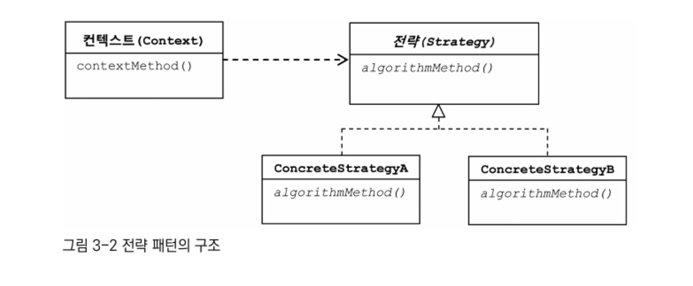
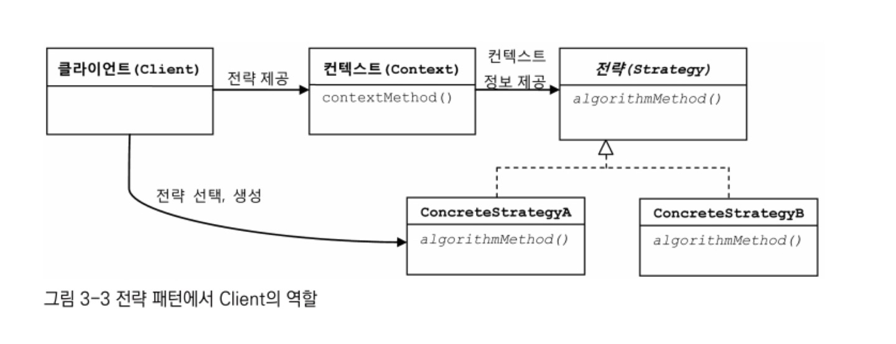

# 토비의 스프링 3.1 Vol.1 스프링의 이해와 원리

## 1장 오브젝트와 의존관계

<details>
<summary id="object-dependency">
<strong>
오브젝트와 의존관계
</strong>
</summary>

<h3>자바빈 (JavaBean)</h3>

- 디폴트 생성자  
  : 매개변수가 없는 기본 생성자를 가지고 있어야 함

  ```
  public class User { public User() { } }
  ```

- 프로퍼티  
  : private 로 선언한 멤버 변수를 getter/setter 매소드로 멤버변수에 접근하여 수정 및 조회

  ````
  public class User {
  private String id;
  private String name;
  private String password;

          public String getId() {
              return id;
          }

          public void setId(String id) {
              this.id = id;
          }

          public String getName() {
              return name;
          }

          public void setName(String name) {
              this.name = name;
          }

          public String getPassword() {
              return password;
          }

          public void setPassword(String password) {
              this.password = password;
          }
      }
      ```
  ````

<br>

<h3>분리와 확장을 고려한 설계</h3>

- 관심사의 분리 (Separation of Concerns)  
  : 하나의 관심사는 하나의 기능만 가지도록 별도로 구성하는 것

<br>

<h3>템플릿 메소드 패턴 (Template Method Pattern)</h3>

- 슈퍼클래스에서 기본적인 로직의 흐름을 구현
- 슈퍼클래스의 매소드는 템플릿, 추상, 훅 메소드 3종류로 분류
  - 템플릿 메소드 (Template Method) : 공통 기능 구현
  - 추상 메소드(Abstract Method) : 서브 클래스에서 구현
  - 훅 메서드(Hook Method) : 기본 기능은 구현 but 서브 클래스에 재구현 가능

<br>

<h3>팩토리 메소드 패턴 (Factory Method Pattern)</h3>

- 객체를 생성하기 위한 방법을 팩토리에 정의
- 구체적인 오브젝트 생성 방식은 서브 클래스에서 결정
- 주로 인터페이스 타입으로 오브젝트를 리턴하기 때문에 슈퍼클래스에서는 서브클래스에서 어떤 오브젝트를 만들어 리턴하는지는 알 수 없음

<br>

<h3>객체지향 설계 원칙 (SOLID)</h3>

- 단일 책임 원칙 (SRP : The Single Reponsibility Principle)  
  : 단일 클래스는 단일 책임만을 가져야 한다.
- 개방 폐쇄 원칙 (OCP : The Open Closed Principle)  
  : 높은 응집도와 낮은 결합도
  - 클래스가 하나의 책임이나 관심사에만 집중되어 있어 변경되어도 외부에 영향을 미치지 않음
- 리스코프 치환 원칙 (LSP : The Liskov Substitution Principle)  
  : 하위 클래스는 부모 클래스의 인터페이스 규약을 지켜야 함
- 인터페이스 분리 원칙 (ISP : The Interface Segregation Principle)  
  : 범용 인터페이스 보다는 구체적인 여러개의 인터페이스
- 의존관계 역전 원칙 (DIP : The Dependency Inversion Principle)  
  : 변하기 쉬운 것(구현체 클래스) 보다는 변화하지 않는 것(인터페이스, 추상 클래스)과 의존관계를 맺어야 함

<br>

<h3>제어의 역전 (Inversion of Control)</h3>

- IOC 컨테이너가 오브젝트 생성, 관계설정, 사용 제거 등 오브젝트 전반(스프링에서는 @Bean)에 걸친 모든 제어권을 갖게 된다는 개념

<br>

<h3>싱글톤 패턴 (Singleton Pattern)</h3>

: 객체의 인스턴스를 하나만 생성하여 생성된 객체를 어디에서나 사욜할 수 있게 하는 것

```
public class Singleton {
    private static Singleton singleton = new Singleton();

    private Singleton() { }

    public static Singleton getInstance() {
        return singleton;
    }

    public void method() { }
}
```

- 장점
  - 객체를 하나만 생성하여 사용하기 때문에 여러 곳에서 생성하지 않아 메모리의 낭비를 방지할 수 있음
  - 인스턴스가 전역으로 선언되기 때문에 클래스 간의 데이터 공유가 용이함
- 단점
  - 하나의 인스턴스를 사용하기 때문에 동시성 문제가 발생할 수 있음
  - 싱글톤으로 구현된 객체가 너무 많은 기능을 가지면 결합도가 높아져 OCP에 위배될 수 있음

<br>

<h3>Reference</h3>

<a>https://coding-factory.tistory.com/712</a>  
<a>https://western-sky.tistory.com/40</a>
<a>https://tecoble.techcourse.co.kr/post/2020-11-07-singleton/</a>

</details>

## 2장 테스트

<details>
<summary id="test">
<strong>
테스트
</strong>
</summary>

<br>

<h3>작은 단위의 테스트 (Unit Test)</h3>

> <p>한꺼번에 많은 과정을 테스트 하게되면 수행 과정도 복잡해지고, 오류의 원인도 찾기 힘들어진다. 따라서 테스트는 가능하면 작은 단위로 쪼개서 집중해서 할 수 있어야 한다.</p>

> <p>일반적으로 단위는 작을수록 좋다. 단위를 넘어서는 다른 코드들은 신경 쓰지 않고 테스트가 동작할 수 있는게 좋다.</p>

> <p>단위 테스트를 거치고 웹에서부터 테스트를 하는 경우 보다 쉽게 오류를 찾을 수 있게 된다.</p>

<br>

<h3>UserDaoTest 의 문제점과 자동화</h3>

> 수동 확인 작업의 번거로움 : 실행 결과를 직접 보고 확인해야함
> 실행 작업의 번거로움 : DaoTest 가 많아질수록 모든 main 메소드를 실행해봐야함

```
// 수정 전
System.out.println(user2.getName());
System.out.println(user2.getPassword());
System.out.println(user2.getId() + " 조회 성공");
```

```
// 수정 후
if (!user.getName().equals(user2.getName())) {
  System.out.println("테스트 실패 (Name)");
} else if (!user.getPassword().equals(user2.getPassword())) {
  System.out.println("테스트 실패 (Password)");
} else {
  System.out.println("조회 테스트 성공");
}
```

- 이처럼 수정 결과를 확인하고 출력해주는 코드로 변경하게 되면 테스트의 실패나 성공의 판단이 쉬워진다.
- 포괄적인 테스트로 구현하고, 테스트 수행과 기대하는 결과에 대한 자동화된 테스트 코드를 만들어 둔다면 오류 유무를 빠르고 간단하게 확인 할 수 있다.

<br>

<h3>JUnit 테스트로 전환</h3>

- @Test Annotation 추가
- public Method 로 전환

```
// Before
public static void main(String[] args) throws ClassNotFoundException, SQLException

if (!user.getName().equals(user2.getName())) { ... }
```

```
// After
@Test
public void addAndGet() throws SQLException, ClassNotFoundException {
  assertThat(user2.getName(), is(user.getName()));
}
...
```

> </p>assertThat(a, b) 메소드는 a의 값을 b(매처) 의 조건과 비교해서 일치하면 다음으로 넘어가고, 아니면 테스트가 실패하도록 만들어준다. </p>

<br>

<h3>테스트 결과의 일관성</h3>

> 테스트 시 중복 데이터 제거

<p>deleteAll(), getCount() 메소드 추가</p>

```
public void deleteAll() throws SQLException {
  Connection c = dataSource.getConnection();

  PreparedStatement ps = c.prepareStatement("DELETE FROM users");

  ps.executeUpdate();

  ps.close();
  c.close();
}

public int getCount() throws SQLException {
  Connection c = dataSource.getConnection();

  PreparedStatement ps = c.prepareStatement("SELECT COUNT(\*) FROM users");

  ResultSet rs = ps.executeQuery();
  rs.next();
  int count = rs.getInt(1);

  rs.close();
  ps.close();
  c.close();

  return count;
}

```

<br>

<h3>학습 테스트</h3>

> 다른 사람이 만든 프레임워크나 라이브러리 등에 대한 테스트 &rarr; 해당 기능에 대한 이해도, 사용 방법을 검증

장점

- <i>다양한 조건에 따른 기능을 손쉽게 확인해볼 수 있다</i>
  : 자동화된 테스트로 다양한 조건의 기능들을 빠르게 확인해볼 수 있다.
- <i>학습 테스트 코드를 개발 중에 참고할 수 있다</i>
  : 학습 테스트 코드로 다양한 기능의 사용법을 익히고 지우지 않고 남겨두면 이후 실제 개발에 들어갔을 때 테스트한 기능들의 코드를 참고하면서 만들 수 있다.
- <i>프레임워크나 제품을 업그레이드할 때 호환성 검증을 도와준다</i>
  : 프레임워크나 API의 버전이 업그레이드 되면서 발생할 수 있는 문제를 테스트 코드를 실행해 봄으로써 파악이 쉬워진다.
- <i>테스트 작성에 대한 좋은 훈련이 된다</i>
  : 테스트 코드에 대해 미숙하다면 학습 테스트 코드를 작성해 보면서 연습해볼 수 있다.
- <i>새로운 기술을 공부하는 과정이 즐거워진다</i>
  : 책이나 레퍼런스를 읽기만 하는 것보다 테스트를 작성하고 기능의 성패를 확인하는 것이 더 지루하지 않을 것이다.

<h3>정리</h3>

- 테스트는 자동화돼야 하고, 빠르게 실행할 수 있어야 한다.
- 테스트 결과는 일관성이 있어야 한다. 환경이나 테스트 실행 순서에 따라서 결과가 달라지면 안된다.
- 테스트는 포괄적으로 작성해야 한다. 충분한 검증이 필요하다.
- 코드 작성과 테스트 수행의 간격이 짧을수록 효과적이다.
- 테스트를 먼저 만들고 테스트를 성공시키는 코드를 만들어가는 TDD도 유용하다.
- 동일한 설정파일을 사용하는 테스트는 하나의 애플리케이션 컨텍스트를 공유한다.
- 기술의 사용 방법을 익히고 이해를 돕기 위해 학습 테스트를 작성하자.
- 오류가 발견될 경우 그에 대한 버그 테스트를 만들어두면 유용하다.

<h3>DI (Dependency Injection)</h3>

- 생성자를 이용한 의존성 주입
  ```
  public interface Animal {
    void sound();
  }

  public class Cat implements Animal {
    @Override
    public void sound() {
      System.out.println("meow~!");
    }
  }

  public class Dog implements Animal {
    @Override
    public void sound() {
      System.out.println("bark~!");
    }
  }

  public class AnimalSound {
    private Animal animal;

    public AnimalSound(Animal animal) {
      this.animal = animal;
    }

    public void sound() {
      animal.sound();
    }
  }

  public class AnimalTest {
    @Test
    public void soundTest() {
      AnimalSound dog = new AnimalSound(new Dog());
      AnimalSound cat = new AnimalSound(new Cat());

      dog.sound();
      cat.sound();
    }
  }
  ```

</details>

## 3장 템플릿

<details open>
<summary id="template">
<strong>
템플릿
</strong>
</summary>
</details>

<br>

<h4>전략 패턴</h4>


> 개방 폐쇄 원칙(OCP)을 잘 지키는 구조이면서도 템플릿 메소드 패턴보다 유연하고 확장성이 뛰어난 것이 오브젝트를 둘로 분리하고 클래스 레벨에서는 인터페이스를 통해서만 의존하도록 만드는 전략 패턴

<br>

<b>구조</b>



컨텍스트(Context)의 contextMethod() 에서 일정한 구조를 가지고 동작하다가 특정 확장 기능은 Strategy 인터페이스를 통해 외부의 전략 클래스에 위임하게 됨

<br>

<b>인터페이스</b>
```
public interface StatementStrategy {
  PreparedStatement makePreparedStatement(Connection c) throws SQLException;
}
```

<br>

<b>전략 클래스</b>
```
public class DeleteAllStatement implements StatementStrategy{
  @Override
  public PreparedStatement makePreparedStatement(Connection c) throws SQLException {
    return c.prepareStatement("DELETE FROM users");
  }
}
```

<br>

<b>try/catch/finally 분리</b>

> 클라이언트로부터 StatementStrategy 타입의 전략 오브젝트를 제공 받고 JDBC 구조로 만들어진 컨텍스트 내에서 작업을 수행한다. 제공받은 전략 오브젝트는 PreparedStatement 생성이 필요한 시점에 호출해서 사용한다.

```
public void jdbcContextWithStatementStrategy(StatementStrategy stmt) throws SQLException {
  Connection c = null;
  PreparedStatement ps = null;

  try {
    c = dataSource.getConnection();
    ps = stmt.makePreparedStatement(c);
    *ps.executeUpdate();
  } catch (SQLException e) {
    throw e;
  } finally {
    if (c != null) { try { c.close(); } catch (SQLException  e) { throw e; } }
    if (ps != null) { try { ps.close(); } catch (SQLException e) { throw e; } }
  }
}
```

<br>

<b>deleteAll()</b>

> deleteAll()은 전략 오브젝트를 만들고 컨텍스트를 호출하는 책임을 지고 있다. 사용할 전략 클래스는 DeleteAllStatement 이므로 해당 클래스의 오브젝트를 생성하고, 컨텍스트로 분리한 jdbcContextWithStatementStrategy() 메소드를 호출한다.

```
public void deleteAll() throws SQLException {
  StatementStrategy st = new DeleteAllStatement();  // 특정 전략 클래스의 오브젝트 생성
  jdbcContextWithStatementStrategy(st); // 컨텍스트 호출, 전략 오브젝트 전달
}
```



<br>

<b>add()</b>

```
public class AddStatement implements StatementStrategy{
  User user;

  public AddStatement(User user) {
    this.user = user;
  }

  @Override
  public PreparedStatement makePreparedStatement(Connection c) throws SQLException {
    PreparedStatement ps = c.prepareStatement("INSERT INTO users(id, name, password) VALUES(?, ?, ?)");

    ps.setString(1, user.getId());
    ps.setString(2, user.getName());
    ps.setString(3, user.getPassword());

    return ps;
  }
}

public class UserDao {
  public void add(User user) throws ClassNotFoundException, SQLException {
    StatementStrategy strategy = new AddStatement(user);
    jdbcContextWithStatementStrategy(strategy);
  }
}
```

<br>

<b>중첩 클래스 (Nested Class)</b>

- 스태틱 클래스 (Static Class)
- 내부 클래스 (Inner Class)
  - 멤버 내부 클래스 (Member Inner Class) : 오브젝트 레벨에 정의
  - 로컬 클래스 (Local Class) : 메소드 레벨에 정의
    > user 를 내부에서 변경할 수 없게 final로 선언을 해주고-그래야 내부 클래스에서 별도 선언 없이 사용 가능- add() 함수 내부의 익명 클래스로 AddStatement 클래스를 작성한다. 로컬 클래스 내부에서 사용되는 user 변수를 final 로 선언했기 때문에, 로컬 클래스에서는 매개변수와 생성자를 통해서 받지 않아도 user에 접근이 가능하다. 또한 로컬 클래스를 선언해줌으로써 이전과 같이 클래스 파일을 하나 더 만들지 않아도 된다.

    > add() 함수 내부에서만 AddStatement 가 필요하다는 가정 하에 이런식으로 사용이 가능하다.

    ```
    public void add(final User user) throws ClassNotFoundException, SQLException {
      class AddStatement implements StatementStrategy {
        @Override
        public PreparedStatement makePreparedStatement(Connection c) throws SQLException {
          PreparedStatement ps = c.prepareStatement("INSERT INTO users(id, name, password) VALUES(?, ?, ?)");

          ps.setString(1, user.getId());
          ps.setString(2, user.getName());
          ps.setString(3, user.getPassword());

          return ps;
        }
      }

      StatementStrategy strategy = new AddStatement();
      jdbcContextWithStatementStrategy(strategy);
    }

    ```
  - 익명 내부 클래스 (Anonymous Inner Class) : 이름을 갖지 않음 - 선언된 위치에 따라 범위가 다름
    > 이름을 갖지 않는 클래스로 클래스 선언과 오브젝트 생성이 결합된 형태 new 인터페이스이름() { 클래스 내용 };
    클래스를 재사용할 필요가 없고, 구현한 인터페이스 타입으로만 사용할 경우에 용이
    ```
    public void add(final User user) throws ClassNotFoundException, SQLException {
      StatementStrategy strategy = new StatementStrategy() {
        @Override
        public PreparedStatement makePreparedStatement(Connection c) throws SQLException {
          PreparedStatement ps = c.prepareStatement("INSERT INTO users(id, name, password) VALUES(?, ?, ?)");

          ps.setString(1, user.getId());
          ps.setString(2, user.getName());
          ps.setString(3, user.getPassword());

          return ps;
        }
      };
      jdbcContextWithStatementStrategy(strategy);
    }
    ```

    ```
    public void add(final User user) throws ClassNotFoundException, SQLException {
      jdbcContextWithStatementStrategy(new StatementStrategy() {
        @Override
        public PreparedStatement makePreparedStatement(Connection c) throws SQLException {
          PreparedStatement ps = c.prepareStatement("INSERT INTO users(id, name, password) VALUES(?, ?, ?)");

          ps.setString(1, user.getId());
          ps.setString(2, user.getName());
          ps.setString(3, user.getPassword());

          return ps;
        }
      });
    }
    ```

<br>

<b>Jdbc try/catch/finally 클래스 분리</b>

```
public class JdbcContext {
  DataSource dataSource;

  public JdbcContext(DataSource dataSource) {
      this.dataSource = dataSource;
  }

  public void workWithStatementStrategy(StatementStrategy stmt) throws SQLException {
    Connection c = null;
    PreparedStatement ps = null;

    try {
      c = dataSource.getConnection();
      ps = stmt.makePreparedStatement(c);
      ps.executeUpdate();
    } catch (SQLException e) {
      throw e;
    } finally {
      if (c != null) { try { c.close(); } catch (SQLException e) { throw e; } }
      if (ps != null) { try { ps.close(); } catch  (SQLException e) { throw e; }
      }
    }
  }
}
```