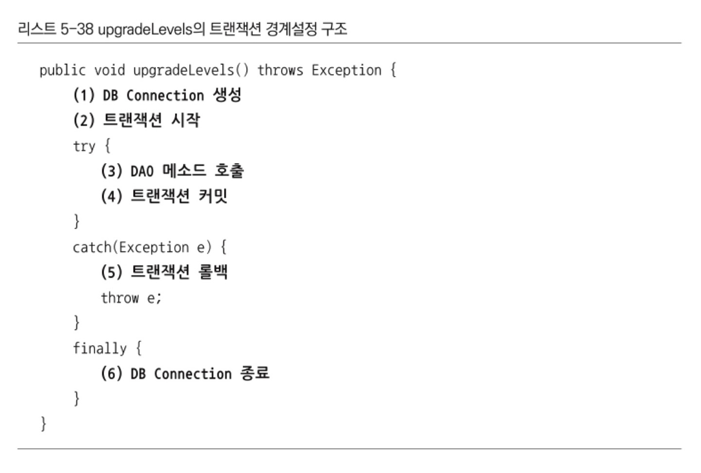

# 토비의 스프링 3.1 Vol.1 스프링의 이해와 원리

## 1장 오브젝트와 의존관계

<details>
<summary id="object-dependency">
<strong>
오브젝트와 의존관계
</strong>
</summary>

<h3>자바빈 (JavaBean)</h3>

- 디폴트 생성자  
  : 매개변수가 없는 기본 생성자를 가지고 있어야 함

  ```
  public class User { public User() { } }
  ```

- 프로퍼티  
  : private 로 선언한 멤버 변수를 getter/setter 매소드로 멤버변수에 접근하여 수정 및 조회

  ````
  public class User {
  private String id;
  private String name;
  private String password;

          public String getId() {
              return id;
          }

          public void setId(String id) {
              this.id = id;
          }

          public String getName() {
              return name;
          }

          public void setName(String name) {
              this.name = name;
          }

          public String getPassword() {
              return password;
          }

          public void setPassword(String password) {
              this.password = password;
          }
      }
      ```
  ````

<br>

<h3>분리와 확장을 고려한 설계</h3>

- 관심사의 분리 (Separation of Concerns)  
  : 하나의 관심사는 하나의 기능만 가지도록 별도로 구성하는 것

<br>

<h3>템플릿 메소드 패턴 (Template Method Pattern)</h3>

- 슈퍼클래스에서 기본적인 로직의 흐름을 구현
- 슈퍼클래스의 매소드는 템플릿, 추상, 훅 메소드 3종류로 분류
  - 템플릿 메소드 (Template Method) : 공통 기능 구현
  - 추상 메소드(Abstract Method) : 서브 클래스에서 구현
  - 훅 메서드(Hook Method) : 기본 기능은 구현 but 서브 클래스에 재구현 가능

<br>

<h3>팩토리 메소드 패턴 (Factory Method Pattern)</h3>

- 객체를 생성하기 위한 방법을 팩토리에 정의
- 구체적인 오브젝트 생성 방식은 서브 클래스에서 결정
- 주로 인터페이스 타입으로 오브젝트를 리턴하기 때문에 슈퍼클래스에서는 서브클래스에서 어떤 오브젝트를 만들어 리턴하는지는 알 수 없음

<br>

<h3>객체지향 설계 원칙 (SOLID)</h3>

- 단일 책임 원칙 (SRP : The Single Reponsibility Principle)  
  : 단일 클래스는 단일 책임만을 가져야 한다.
- 개방 폐쇄 원칙 (OCP : The Open Closed Principle)  
  : 높은 응집도와 낮은 결합도
  - 클래스가 하나의 책임이나 관심사에만 집중되어 있어 변경되어도 외부에 영향을 미치지 않음
- 리스코프 치환 원칙 (LSP : The Liskov Substitution Principle)  
  : 하위 클래스는 부모 클래스의 인터페이스 규약을 지켜야 함
- 인터페이스 분리 원칙 (ISP : The Interface Segregation Principle)  
  : 범용 인터페이스 보다는 구체적인 여러개의 인터페이스
- 의존관계 역전 원칙 (DIP : The Dependency Inversion Principle)  
  : 변하기 쉬운 것(구현체 클래스) 보다는 변화하지 않는 것(인터페이스, 추상 클래스)과 의존관계를 맺어야 함

<br>

<h3>제어의 역전 (Inversion of Control)</h3>

- IOC 컨테이너가 오브젝트 생성, 관계설정, 사용 제거 등 오브젝트 전반(스프링에서는 @Bean)에 걸친 모든 제어권을 갖게 된다는 개념

<br>

<h3>싱글톤 패턴 (Singleton Pattern)</h3>

: 객체의 인스턴스를 하나만 생성하여 생성된 객체를 어디에서나 사욜할 수 있게 하는 것

```
public class Singleton {
    private static Singleton singleton = new Singleton();

    private Singleton() { }

    public static Singleton getInstance() {
        return singleton;
    }

    public void method() { }
}
```

- 장점
  - 객체를 하나만 생성하여 사용하기 때문에 여러 곳에서 생성하지 않아 메모리의 낭비를 방지할 수 있음
  - 인스턴스가 전역으로 선언되기 때문에 클래스 간의 데이터 공유가 용이함
- 단점
  - 하나의 인스턴스를 사용하기 때문에 동시성 문제가 발생할 수 있음
  - 싱글톤으로 구현된 객체가 너무 많은 기능을 가지면 결합도가 높아져 OCP에 위배될 수 있음

<br>

<h3>Reference</h3>

<a>https://coding-factory.tistory.com/712</a>  
<a>https://western-sky.tistory.com/40</a>
<a>https://tecoble.techcourse.co.kr/post/2020-11-07-singleton/</a>

</details>

## 2장 테스트

<details>
<summary id="test">
<strong>
테스트
</strong>
</summary>

<br>

<h3>작은 단위의 테스트 (Unit Test)</h3>

> <p>한꺼번에 많은 과정을 테스트 하게되면 수행 과정도 복잡해지고, 오류의 원인도 찾기 힘들어진다. 따라서 테스트는 가능하면 작은 단위로 쪼개서 집중해서 할 수 있어야 한다.</p>

> <p>일반적으로 단위는 작을수록 좋다. 단위를 넘어서는 다른 코드들은 신경 쓰지 않고 테스트가 동작할 수 있는게 좋다.</p>

> <p>단위 테스트를 거치고 웹에서부터 테스트를 하는 경우 보다 쉽게 오류를 찾을 수 있게 된다.</p>

<br>

<h3>UserDaoTest 의 문제점과 자동화</h3>

> 수동 확인 작업의 번거로움 : 실행 결과를 직접 보고 확인해야함
> 실행 작업의 번거로움 : DaoTest 가 많아질수록 모든 main 메소드를 실행해봐야함

```
// 수정 전
System.out.println(user2.getName());
System.out.println(user2.getPassword());
System.out.println(user2.getId() + " 조회 성공");
```

```
// 수정 후
if (!user.getName().equals(user2.getName())) {
  System.out.println("테스트 실패 (Name)");
} else if (!user.getPassword().equals(user2.getPassword())) {
  System.out.println("테스트 실패 (Password)");
} else {
  System.out.println("조회 테스트 성공");
}
```

- 이처럼 수정 결과를 확인하고 출력해주는 코드로 변경하게 되면 테스트의 실패나 성공의 판단이 쉬워진다.
- 포괄적인 테스트로 구현하고, 테스트 수행과 기대하는 결과에 대한 자동화된 테스트 코드를 만들어 둔다면 오류 유무를 빠르고 간단하게 확인 할 수 있다.

<br>

<h3>JUnit 테스트로 전환</h3>

- @Test Annotation 추가
- public Method 로 전환

```
// Before
public static void main(String[] args) throws ClassNotFoundException, SQLException

if (!user.getName().equals(user2.getName())) { ... }
```

```
// After
@Test
public void addAndGet() throws SQLException, ClassNotFoundException {
  assertThat(user2.getName(), is(user.getName()));
}
...
```

> </p>assertThat(a, b) 메소드는 a의 값을 b(매처) 의 조건과 비교해서 일치하면 다음으로 넘어가고, 아니면 테스트가 실패하도록 만들어준다. </p>

<br>

<h3>테스트 결과의 일관성</h3>

> 테스트 시 중복 데이터 제거

<p>deleteAll(), getCount() 메소드 추가</p>

```
public void deleteAll() throws SQLException {
  Connection c = dataSource.getConnection();

  PreparedStatement ps = c.prepareStatement("DELETE FROM users");

  ps.executeUpdate();

  ps.close();
  c.close();
}

public int getCount() throws SQLException {
  Connection c = dataSource.getConnection();

  PreparedStatement ps = c.prepareStatement("SELECT COUNT(\*) FROM users");

  ResultSet rs = ps.executeQuery();
  rs.next();
  int count = rs.getInt(1);

  rs.close();
  ps.close();
  c.close();

  return count;
}

```

<br>

<h3>학습 테스트</h3>

> 다른 사람이 만든 프레임워크나 라이브러리 등에 대한 테스트 &rarr; 해당 기능에 대한 이해도, 사용 방법을 검증

장점

- <i>다양한 조건에 따른 기능을 손쉽게 확인해볼 수 있다</i>
  : 자동화된 테스트로 다양한 조건의 기능들을 빠르게 확인해볼 수 있다.
- <i>학습 테스트 코드를 개발 중에 참고할 수 있다</i>
  : 학습 테스트 코드로 다양한 기능의 사용법을 익히고 지우지 않고 남겨두면 이후 실제 개발에 들어갔을 때 테스트한 기능들의 코드를 참고하면서 만들 수 있다.
- <i>프레임워크나 제품을 업그레이드할 때 호환성 검증을 도와준다</i>
  : 프레임워크나 API의 버전이 업그레이드 되면서 발생할 수 있는 문제를 테스트 코드를 실행해 봄으로써 파악이 쉬워진다.
- <i>테스트 작성에 대한 좋은 훈련이 된다</i>
  : 테스트 코드에 대해 미숙하다면 학습 테스트 코드를 작성해 보면서 연습해볼 수 있다.
- <i>새로운 기술을 공부하는 과정이 즐거워진다</i>
  : 책이나 레퍼런스를 읽기만 하는 것보다 테스트를 작성하고 기능의 성패를 확인하는 것이 더 지루하지 않을 것이다.

<h3>정리</h3>

- 테스트는 자동화돼야 하고, 빠르게 실행할 수 있어야 한다.
- 테스트 결과는 일관성이 있어야 한다. 환경이나 테스트 실행 순서에 따라서 결과가 달라지면 안된다.
- 테스트는 포괄적으로 작성해야 한다. 충분한 검증이 필요하다.
- 코드 작성과 테스트 수행의 간격이 짧을수록 효과적이다.
- 테스트를 먼저 만들고 테스트를 성공시키는 코드를 만들어가는 TDD도 유용하다.
- 동일한 설정파일을 사용하는 테스트는 하나의 애플리케이션 컨텍스트를 공유한다.
- 기술의 사용 방법을 익히고 이해를 돕기 위해 학습 테스트를 작성하자.
- 오류가 발견될 경우 그에 대한 버그 테스트를 만들어두면 유용하다.

<h3>DI (Dependency Injection)</h3>

- 생성자를 이용한 의존성 주입

  ```
  public interface Animal {
    void sound();
  }

  public class Cat implements Animal {
    @Override
    public void sound() {
      System.out.println("meow~!");
    }
  }

  public class Dog implements Animal {
    @Override
    public void sound() {
      System.out.println("bark~!");
    }
  }

  public class AnimalSound {
    private Animal animal;

    public AnimalSound(Animal animal) {
      this.animal = animal;
    }

    public void sound() {
      animal.sound();
    }
  }

  public class AnimalTest {
    @Test
    public void soundTest() {
      AnimalSound dog = new AnimalSound(new Dog());
      AnimalSound cat = new AnimalSound(new Cat());

      dog.sound();
      cat.sound();
    }
  }
  ```

</details>

## 3장 템플릿

<details>
<summary id="template">
<strong>
템플릿
</strong>
</summary>

<br>

<h3>전략 패턴</h3>

> 개방 폐쇄 원칙(OCP)을 잘 지키는 구조이면서도 템플릿 메소드 패턴보다 유연하고 확장성이 뛰어난 것이 오브젝트를 둘로 분리하고 클래스 레벨에서는 인터페이스를 통해서만 의존하도록 만드는 전략 패턴

<br>

<b>구조</b>


컨텍스트(Context)의 contextMethod() 에서 일정한 구조를 가지고 동작하다가 특정 확장 기능은 Strategy 인터페이스를 통해 외부의 전략 클래스에 위임하게 됨

<br>

<b>인터페이스</b>

```
public interface StatementStrategy {
  PreparedStatement makePreparedStatement(Connection c) throws SQLException;
}
```

<br>

<b>전략 클래스</b>

```
public class DeleteAllStatement implements StatementStrategy{
  @Override
  public PreparedStatement makePreparedStatement(Connection c) throws SQLException {
    return c.prepareStatement("DELETE FROM users");
  }
}
```

<br>

<b>try/catch/finally 분리</b>

> 클라이언트로부터 StatementStrategy 타입의 전략 오브젝트를 제공 받고 JDBC 구조로 만들어진 컨텍스트 내에서 작업을 수행한다. 제공받은 전략 오브젝트는 PreparedStatement 생성이 필요한 시점에 호출해서 사용한다.

```
public void jdbcContextWithStatementStrategy(StatementStrategy stmt) throws SQLException {
  Connection c = null;
  PreparedStatement ps = null;

  try {
    c = dataSource.getConnection();
    ps = stmt.makePreparedStatement(c);
    *ps.executeUpdate();
  } catch (SQLException e) {
    throw e;
  } finally {
    if (c != null) { try { c.close(); } catch (SQLException  e) { throw e; } }
    if (ps != null) { try { ps.close(); } catch (SQLException e) { throw e; } }
  }
}
```

<br>

<b>deleteAll()</b>

> deleteAll()은 전략 오브젝트를 만들고 컨텍스트를 호출하는 책임을 지고 있다. 사용할 전략 클래스는 DeleteAllStatement 이므로 해당 클래스의 오브젝트를 생성하고, 컨텍스트로 분리한 jdbcContextWithStatementStrategy() 메소드를 호출한다.

```
public void deleteAll() throws SQLException {
  StatementStrategy st = new DeleteAllStatement();  // 특정 전략 클래스의 오브젝트 생성
  jdbcContextWithStatementStrategy(st); // 컨텍스트 호출, 전략 오브젝트 전달
}
```


<br>

<b>add()</b>

```
public class AddStatement implements StatementStrategy{
  User user;

  public AddStatement(User user) {
    this.user = user;
  }

  @Override
  public PreparedStatement makePreparedStatement(Connection c) throws SQLException {
    PreparedStatement ps = c.prepareStatement("INSERT INTO users(id, name, password) VALUES(?, ?, ?)");

    ps.setString(1, user.getId());
    ps.setString(2, user.getName());
    ps.setString(3, user.getPassword());

    return ps;
  }
}

public class UserDao {
  public void add(User user) throws ClassNotFoundException, SQLException {
    StatementStrategy strategy = new AddStatement(user);
    jdbcContextWithStatementStrategy(strategy);
  }
}
```

<br>

<b>중첩 클래스 (Nested Class)</b>

- 스태틱 클래스 (Static Class)
- 내부 클래스 (Inner Class)

  - 멤버 내부 클래스 (Member Inner Class) : 오브젝트 레벨에 정의
  - 로컬 클래스 (Local Class) : 메소드 레벨에 정의

    > user 를 내부에서 변경할 수 없게 final로 선언을 해주고-그래야 내부 클래스에서 별도 선언 없이 사용 가능- add() 함수 내부의 익명 클래스로 AddStatement 클래스를 작성한다. 로컬 클래스 내부에서 사용되는 user 변수를 final 로 선언했기 때문에, 로컬 클래스에서는 매개변수와 생성자를 통해서 받지 않아도 user에 접근이 가능하다. 또한 로컬 클래스를 선언해줌으로써 이전과 같이 클래스 파일을 하나 더 만들지 않아도 된다.

    > add() 함수 내부에서만 AddStatement 가 필요하다는 가정 하에 이런식으로 사용이 가능하다.

    ```
    public void add(final User user) throws ClassNotFoundException, SQLException {
      class AddStatement implements StatementStrategy {
        @Override
        public PreparedStatement makePreparedStatement(Connection c) throws SQLException {
          PreparedStatement ps = c.prepareStatement("INSERT INTO users(id, name, password) VALUES(?, ?, ?)");

          ps.setString(1, user.getId());
          ps.setString(2, user.getName());
          ps.setString(3, user.getPassword());

          return ps;
        }
      }

      StatementStrategy strategy = new AddStatement();
      jdbcContextWithStatementStrategy(strategy);
    }

    ```

  - 익명 내부 클래스 (Anonymous Inner Class) : 이름을 갖지 않음 - 선언된 위치에 따라 범위가 다름

    > 이름을 갖지 않는 클래스로 클래스 선언과 오브젝트 생성이 결합된 형태 new 인터페이스이름() { 클래스 내용 };
    > 클래스를 재사용할 필요가 없고, 구현한 인터페이스 타입으로만 사용할 경우에 용이

    ```
    public void add(final User user) throws ClassNotFoundException, SQLException {
      StatementStrategy strategy = new StatementStrategy() {
        @Override
        public PreparedStatement makePreparedStatement(Connection c) throws SQLException {
          PreparedStatement ps = c.prepareStatement("INSERT INTO users(id, name, password) VALUES(?, ?, ?)");

          ps.setString(1, user.getId());
          ps.setString(2, user.getName());
          ps.setString(3, user.getPassword());

          return ps;
        }
      };
      jdbcContextWithStatementStrategy(strategy);
    }
    ```

    ```
    public void add(final User user) throws ClassNotFoundException, SQLException {
      jdbcContextWithStatementStrategy(new StatementStrategy() {
        @Override
        public PreparedStatement makePreparedStatement(Connection c) throws SQLException {
          PreparedStatement ps = c.prepareStatement("INSERT INTO users(id, name, password) VALUES(?, ?, ?)");

          ps.setString(1, user.getId());
          ps.setString(2, user.getName());
          ps.setString(3, user.getPassword());

          return ps;
        }
      });
    }
    ```

<br>

<b>Jdbc try/catch/finally 클래스 분리</b>

```
public class JdbcContext {
  DataSource dataSource;

  public JdbcContext(DataSource dataSource) {
      this.dataSource = dataSource;
  }

  public void workWithStatementStrategy(StatementStrategy stmt) throws SQLException {
    Connection c = null;
    PreparedStatement ps = null;

    try {
      c = dataSource.getConnection();
      ps = stmt.makePreparedStatement(c);sh
      ps.executeUpdate();
    } catch (SQLException e) {
      throw e;
    } finally {
      if (c != null) { try { c.close(); } catch (SQLException e) { throw e; } }
      if (ps != null) { try { ps.close(); } catch  (SQLException e) { throw e; }
      }
    }
  }
}
```

<br>

<b>템플릿/콜백 패턴</b>

> 전략 패턴의 컨텍스트를 템플릿, 익명 내부 클래스로 만들어지는 오브젝트를 콜백이라고 하여 위와 같은 방식을 템플릿/콜백 패턴이라고 한다.

<br>


- 클라이언트의 역할은 템플릿 안에서 실행될 로직을 담은 콜백 오브젝트를 만들고, 콜백이 참조할 정보를 제공하는 것이다. 만들어진 콜백은 클라이언트가 템플릿의 메소드르를 호출할 때 파라미터로 전달된다.
- 템플릿은 정해진 작업 흐름을 따라 작업을 진행하다가 내부에서 생성한 참조정보를 가지고 콜백 오브젝트의 메소드를 호출한다. 콜백은 클라이언트 메소드에 있는 정보와 템플릿이 제공한 참조정보를 이용해서 작업을 수행하고 그 결과를 다시 템플릿에 돌려준다.
- 템플릿은 콜백이 돌려준 정보를 사용해서 작업을 마저 수행환다. 경우에 따라 최종 결과를 클라이언트에 다시 돌려주기도 한다.

<br>


<br>

<b>JDBC Template</b>

```
public class UserDao {
  private JdbcTemplate jdbcTemplate;

  public void setDataSource(DataSource dataSource) {
    this.jdbcTemplate = new JdbcTemplate(dataSource);
  }

  public void add(final User user) throws ClassNotFoundException, SQLException {
    this.jdbcTemplate.update("INSERT INTO users(id, name, password) VALUES(?, ?, ?)", user.getId(), user.getName(), user.getPassword());
  }

  public User get(String id) throws ClassNotFoundException, SQLException {
    return this.jdbcTemplate.queryForObject(
            "SELECT * FROM users WHERE id = ?",
            new Object[]{id},
            userMapper
    );
  }

  public List<User> getAll() {
    return this.jdbcTemplate.query(
            "SELECT * FROM users",
            userMapper
    );
  }

  @Bean
  public void deleteAll() throws SQLException {
    this.jdbcTemplate.update("DELETE FROM users");
  }

  public int getCount() throws SQLException {
    return this.jdbcTemplate.queryForObject("SELECT COUNT(*) FROM users", Integer.class);
  }

  private RowMapper<User> userMapper = new RowMapper<User>() {
    @Override
    public User mapRow(ResultSet rs, int rowNum) throws SQLException {
      User user = new User();
      user.setId(rs.getString("id"));
      user.setName(rs.getString("name"));
      user.setPassword(rs.getString("password"));
      return user;
    }
  };
}
```

<br>

<h3>정리</h3>

- JDBC와 같이 예외 발생 가능성이 있고, 공유 리소스의 반환이 필요한 코드는 반드시 try/catch/finally 블록으로 관리해야 한다.
- 일정한 작업 흐름이 반복되면서 그중 일부 기능만 바뀌는 코드가 존재한다면 전략 패턴을 적용한다. 바뀌지 않는 부분은 컨텍스트로, 바뀌는 부분을 전략으로 만들고 인터페이스를 통해 유연하게 전략을 변경할 수 있도록 구성한다.
- 컨텍스트가 하나 이상의 클라이언트 오브젝트에서 사용된다면 클래스를 분리해서 공유하도록 만든다.
- 컨텍스트는 별도의 빈으로 등록해서 DI 받거나 클라이언트 클래스에서 직접 생성해서 사용한다. 클래스 내부에서 컨텍스트를 사용할 때 컨텍스트가 의존하는 외부의 오브젝트가 있다면 코드를 이용해서 직접 DI 해줄 수 있다.
- 단일 전략 메소드를 갖는 전략 패턴이면서 익명 내부 클래스를 사용해서 매번 전략을 새로 만들어 사용하고, 컨텍스트 호출과 동시에 전략 DI를 수행하는 방식을 템플릿/콜백 패턴이라고 한다.
</details>

## 4장 예외

<details>
<summary id="exception">
<strong>
예외
</strong>
</summary>

<h3>초난감 예외처리</h3>

<b>예외 블랙홀</b>

- 예외를 무시하는 코드
  : 예외가 발생했을 때 이처럼 그냥 넘어가버리면 예외가 발생하는 것보다 더 위험하다. 어플리케이션의 어딘가에서 예외가 발생했는데 무시하고 진행하게 되면 이후에 예상치 못한 문제가 발생할 수 있다.

  ```
  try {
    ...
  } catch (SQLException e) {

  }
  ```

- 예외를 콘솔창에 출력만 해주는 코드
  : 개발 초기에나 운영을 시작하지 않은 상태에서는 메세지를 확인할 수 있어 유용할수도 있다. 하지만 다른 로그나 메시지가 많아지거나 운영서버에 올라갔을 때는 일일히 확인하고 처리하는 것이 불가능해진다.

  ```
  try {
    ...
  } catch (SQLException e) {
    System.out.println(e);
  }

  try {
    ...
  } catch (SQLException e) {
    e.printStackTrace();
  }
  ```

- 차라리...
  : 실제로 이렇게 사용할 수는 없겠지만, 예외를 잡아서 조취를 취할 방법이 없다면 굳이 잡아서 위의 코드들처럼 해주는 것보단 종료시키는게 나을지도..

  ```
  try {
    ...
  } catch (SQLException e) {
    e.printStackTrace();
    System.exit(1);
  }
  ```

<br>

<b>예외의 종류와 특징</b>

- 체크 예외 (Checked Exception)
  : RuntimeException 을 상속하지 않은 Exception의 서브클래스로 체크예외가 발생할 수 있는 메소드를 사용할 경우 반드시 예외를 처리하는 코드를 함께 작성해야 한다. (throw, try/catch/finally)
  예외를 어떤식으로든 복구할 가능성이 있는 경우에 해당한다. 또한 예외를 처리해주지 않을 경우 컴파일 에러가 발생한다.

- 언체크 예외 (Unchecked Exception)
  : RuntimeException 을 상속한 Exception의 서브클래스로 명시적인 예외처리를 강제하지 않는다. 런타임 예외는 예외 처리를 강제하지 않는다. NullPointerException 이나 IlleagalArgumentException 처럼 개발자의 부주의로 인한 상황에서 발생하는 예외이다.

<br>

<b>예외처리 방법</b>

- 예외 복구
  : 예외로 인해 기본 작업 흐름이 불가능하다면 다른 작업 흐름으로 자연스럽게 유도한다. 이런 경우 예외상황은 다시 정상으로 돌아오고, 예외를 복구했다고 볼 수 있다.

  ```
  int maxretry = MAX_RETRY;
  while (maxretry-- > 0) {
    try{
      ...
      return;
    } catch (SomeException e) {
      // 로그 출력, 정해진 시간만큼 대기
    } finally {
      // 리소스 반납, 정리 작업
    }
  }
  throw new RetryFailedException(); // 최대 재시도 횟수를 넘기면 예외 발생
  ```

- 예외 처리 회피
  : 예외처리를 자신을 호출한 쪽으로 던져버리는 것으로 catch 문으로 예외를 잡은 후 로그를 출력하고 예외를 던지는 것이다.
  예외를 회피하는 것은 예외를 복구하는 것처럼 의도가 분명해야 한다. 콜백/템플릿처럼 긴밀한 관계에 있는 다른 오브젝트에게 예외처리 책임을 분명히 지게 하거나, 자신을 호출하는 쪽에서 예외를 다루는 게 최선의 방법이라는 분명한 확신이 있을 때 사용해야 한다.

  ```
  public void add() throws SQLException {
    ... // JDBC flow ~
  }

  public void add() throws SQLException {
    try {
      ... // JDBC flow ~
    } catch (SQLException e) {
      // 로그 출력
      throw e;
    }
  }
  ```

<br>

<b>애플리케이션 예외</b>
: 시스템 또는 외부의 예외상황이 원인이 아니라 애플리케이션 자체의 로직에 의해 의도적으로 발생시키고, 반드시 catch해서 무언가의 조치를 취하도록 하는 예외

```
// 은행 출금/ 잔고 확인의 기능을 담은 메소드 구현
try {
  BigDecimal balance = account.withdraw(amount);
  ... // 정상 결과 메시지 출력
} catch (InsufficientBalanceException e) {
  // InsufficientBalanceException에 담긴 인출 가능한 잔고금액의 정보를 가져온다.
  BigDecimal availFunds = e.getAvailFunds();
  ...
  // 잔고 부족 결과 메시지 출력
}

```

<br>

<h3>예외 전환</h3>

> 예외 회피와 같이 예외를 복구해서 정상적인 상태로는 만들 수 없을 때 밖으로 예외를 던지는 것이다. 하지만 발생한 예외를 적절한 예외로 전환해서 던지는 방식이다.

<br>

<b>예외 전환의 목적</b>

- 런타임 예외로 포장하여 굳이 필요하지 않은 catch/throws 를 없애주는 것
- 로우레벨의 예외를 좀 더 의미 있고 추상화된 예외로 바꿔서 던져주는 것
  : 내부에서 발생한 예외를 그대로 던지는 것이 그 예외상황에 대한 적절한 의미를 부여해주지 못하는 경우에, 예외 전환을 통하여 의미를 분명하게 해줄 수 있는 예외로 바꿔서 메소드를 호출한 쪽에서 적절하게 해석하고 복구할 수 있게 해줄 수 있다.
  ```
  public void add(User user) throws DuplicateUserIdException, SQLException {
    try {
      // JDBC user table insert
    } catch (SQLException e) {
      if (e.getErrorCode() == MysqlErrorNumbers.ER_ENTRY)
        throw DuplicateUserIdException(); // Mysql 에서 Duplicate Entry 예외상황 일 때 DuplicateUserIdException 같은 구체적인 예외를 만들어서 던져줌
      else
        throw e;
    }
  }
  ```

<br>

<b>JDBC의 한계</b>
: JDBC는 자바를 이용해 DB에 접근하는 방법을 추상화된 API 형태로 정희해놓고, 각 DB 업체가 JDBC 표준을 따라 만들어진 드라이버를 제공하게 해준다. 내부 구현을 DB 마다 다를 수 있지만 JDBC의 Connection, Statement, ResultSet 등의 표준 인터페이스를 통해 DB 종류에 상관없이 일관된 방법으로 프로그램을 개발할 수 있다.
하지만 DB 종류에 상관없이 사용할 수 있는 데이터 액세스 코드를 작성하는 것은 쉽지 않다. 표준화된 JDBC API도 DB를 자유롭게 변경해서 사용할 수 있는 유연한 코드를 보장해주지는 못한다.

- 비표준 SQL
  : SQL은 어느 정도 표준화된 언어이고 몇 가지 표준 규약이 있긴 하지만, 대부분의 DB는 표준을 따르지 않는 비표준 문법과 기능도 제공한다. 대용량 데이터를 처리하기 위해 최적화 기법을 SQL에 적용하거나, 페이징 처리를 위해 쿼리에 조건을 포함시키거나, 특별한 기능을 제공하는 함수를 SQL에 사용하려면 비표준 SQL 문장이 만들어진다. 이렇게 작성된 비표준 SQL은 결국 DAO 코드에 들어가게 되고, 해당 DAO는 특정 DB에 종속적인 코드가 되어버린다.

- 호환성 없는 SQLException의 DB 에러 정보
  : SQLException은 수백여 가지의 예외 정보들을 catch 하게 된다. 또한 DB 마다 에러의 종류와 원인이 제각각인데 반해 JDBC는 데이터 처리 중에 발생하는 다양한 예외를 그냥 SQLException 하나에 담아버린다. 또한 DB 에러코드 또한 DB 별로 다르기 때문에 각 DB 별로 에러 코드에 대한 대응을 다르게 취해줘야 한다.

<br>

<h3>기술에 독립적인 UserDao</h3>

- DAO 인터페이스
  : DAO를 데이터 액세스 로직을 담은 코드의 성격이 다른 코드에서 분리하는 방식을 사용하면 전략 패턴과 같은 방법을 적용해 구현 방법을 변경해서 사용할 수 있다. DAO를 사용하는 쪽에서는 DAO가 내부에서 어떤 데이터 액세스 기술을 사용하는지 신경 쓰지 않을 수 있다.

  ```
  // UserDao
  public interface UserDao {
    void add (User user);
    User get(String id);
    List<User> getAll();
    void deleteAll();
    int getCount();
  }
  ```

  이와 같이 UserDao를 인터페이스로 선언하는 경우 JDBC, JPA, Hibernate 에 따라서 UserDaoJdbc, UserDaoJpa, UserDaoHibernate 라는 클래스로 각 기술에 맞춰 구현할 수 있다.

<br>

<h3>정리</h3>

- 예외를 잡아서 아무런 조취를 취하지 않거나 의미 없는 throws 선언을 습관처럼 사용하는 것은 위험하다.
- 예외는 복구하거나, 예외 처리 오브젝트로 의도적으로 전달하거나, 적절한 예외로 전환하여 던져줘야 한다.
- 예외를 전달할 때는 좀 더 의미 있는 예외로 변경하거나, 해결할 수 없는 예외들은 런타임 예외로 포장하는 방법이 있다.
- JDBC의 SQLException은 대부분 복구할 수 없는 예외이므로 런타임 예외로 포장하는 것이 바람직하다.
- SQLException의 에러코드는 DB에 종속되기 때문에 각 DB에 맞는 독립적인 예외로 전환할 필요가 있다.
- 스프링은 DataAccessException을 통해 DB에 독립적으로 적용 가능한 추상화된 런타임 예외 계층을 제공한다.
- DAO를 데이터 액세스 기술에서 독립시키려면 인터페이스 도입과 런타임 예외 전환, 기술에 독립적인 추상화된 예외로의 전환이 필요하다.
</details>

## 5장 서비스 추상화

<details open>
<summary id="abstraction">
<strong>
서비스 추상화
</strong>
</summary>

<h3>트랜잭션</h3>

> DB는 그 자체로 트랜잭션을 지원한다. SQL을 통해 다중 로우의 수정이나 삭제 요청을 했을 때, 일부 로우만 삭제되는 경우는 없다. 하나의 SQL 명령을 처리하는 경우는 DB가 트랜잭션을 보장해준다고 믿을 수 있다. 

> 하지만, 여러 개의 SQL이 사용되는 작업을 하나의 트랜잭션으로 취급해야 하는 경우가 있다. 예를 들면 계좌이체가 있다. 계좌이체 작업은 반드시 하나의 트랜잭션으로 묶여서 일어나야 한다. 이체를 할 때, 출금계좌의 잔고는 줄어들고 입금계좌의 잔고는 증가해야 한다. 이 때 이체 프로그램은 DB에 두 번 요청을 보낸다. 적어도 DB 출금계좌, 입금계좌의 잔고를 수정하는 두 개의 SQL이 필요하다.

<br>

- 트랜잭션 롤백 (transaction rollback)

: 첫 번째 SQL을 성공적으로 실행했지만 두 번째 SQL이 성공하기 전에 장애가 생겨서 작업이 중단되는 경우

- 트랜잭션 커밋 (transaction commit)

: 여러 개의 SQL이 하나의 트랜잭션으로 묶여러 처리될 때, 모든 SQL 실행이 오류 없이 실행됐을 경우 DB에 알려줘서 작업을 확정시키는 경우

<br>

<b>JDBC 트랜잭션</b>

```
Connection c = dataSource.getConnection();

c.setAutoCommit(false);
try {
  PreparedStatement st1 = c.prepareStatement("update users ...");
  st1.executeUpdate();

  PreparedStatement st2 = c.prepareStatement("delete users ...");
  st2.executeUpdate();

  c.commit();
} catch (Exception e) {
  c.rollback();
}
c.close();
```

<br>


DAO에서 비즈니스 로직을 처리하지 않고, 지금 나눠둔 (Service-DAO) 구조를 가지고 가려면 Service 내의 함수가 다음과 같은 구조를 가지고 있어야 한다.  

<br>


트랜잭션을 설정해주기 위해 DAO의 메소드들은 Connection 을 파라미터로 받아서 사용하는 코드를 사용할 수 있다. 하지만 이 작업은 매번 Connection을 받아서 사용해야 한다.

<b>트랜잭션 동기화</b>
: JdbcTemplate는 트랜잭션 동기화 기능을 지원하는 유틸리티 메소드를 제공한다. 이를 사용하면 DAO 메소드의 파라미터를 그대로 둔채로 사용할 수 있다. 또한 별도의 설정 없이 외부에서 트랜잭션 설정을 해주면 DAO의 내부에서는 외부에서 선언해준 Connection을 받아서 사용하게 된다.

```
public void upgradeLevels() throws Exception {
  TransactionSynchronizationManager.initSynchronization();
  Connection c = DataSourceUtils.getConnection(dataSource);
  c.setAutoCommit(false);

  try {
    List<User> users = userDao.getAll();

    for (User user : users) {
      if (canUpgradeLevel(user)) {
        upgradeLevel(user);
      }
    }
    c.commit();
  } catch (Exception e) {
    c.rollback();
    throw e;
  } finally {
    DataSourceUtils.releaseConnection(c, dataSource);   // DB Connection Close
    // 동기화 종료 및 정리
    TransactionSynchronizationManager.unbindResource(this.dataSource);
    TransactionSynchronizationManager.clearSynchronization();
  }
}
```

<br>

<b>JTA (Java Transaction API)</b>


```
InitialContext ctx = new InitialContext();
UserTransaction tx = (UserTransaction) ctx.lookup(USER_TX_JNDI_NAME);
tx.begin();
Connection c = dataSource.getConnection();

try {
  // 데이터 엑세스 코드
  tx.commit();
} catch (Exception e) {
  tx.rollback();
  throw e;
} finally {
  c.close();
}
```

<br>

<h3>트랜잭션 추상화</h3>

> 스프링이 제공하는 트랜잭션 추상화 API를 사용하면 비즈니스 로직의 수정이 아닌 DB 정보를 수정하는 작업에서 Service 의 코드를 수정하지 않아도 된다.


<br>

<b>트랜잭션 분리</b>

```
private PlatformTransactionManager transactionManager;

public void setTransactionManager(PlatformTransactionManager transactionManager) {
  this.transactionManager = transactionManager;
}

public void upgradeLevels() throws Exception {
  TransactionStatus status = this.transactionManager.getTransaction(new DefaultTransactionDefinition());

  try {
    List<User> users = userDao.getAll();

    for (User user : users) {
      if (canUpgradeLevel(user)) {
        upgradeLevel(user);
      }
    }
    this.transactionManager.commit(status);
  } catch (Exception e) {
    this.transactionManager.rollback(status);
    throw e;
  } finally {
  }
}
```

```
@Bean
public TransactionManager transactionManager() {
  PlatformTransactionManager transactionManager = new DataSourceTransactionManager(dataSource());
  /*PlatformTransactionManager transactionManager = new JtaTransactionManager(); // JTA 이용시*/

  return transactionManager;
}
```

<br>

<h3>정리</h3>

- 비즈니스 로직을 담은 코드는 데이터 액세스 로직을 담은 코드와 깔끔하게 분리되는 것이 바람직하다. 비즈니스 로직 코드 또한 내부적으로 책임과 역할에 따라서 깔끔하게 메소드로 정리돼야 한다.
- 이를 위해서는 DAO의 기술 변화에 서비스 계층의 코드가 영향을 받지 않
-도록 인터페이스와 DI를 잘 활용해서 결합도를 낮춰줘야 한다.
- DAO를 사용하는 비즈니스 로직에는 단위 작업을 보장해주는 트랜잭션이 필요하다.
- 트랜잭션의 시작과 종료를 지정하는 일을 트랜잭션 경계설정이라고 한다. 트랜잭션 경계설정을 주로 비즈니스 로직(Service) 안에서 일어나는 경우가 많다.
- 시작된 트랜잭션 정보를 담은 오브젝트를 파라미터로 DAO에 전달하는 방법은 매우 비효율적이기 때문에 스프링이 제공하는 트랜잭션 동기화 기법을 활용하는 것이 편리하다.
- 트랜잭션 경계설정 코드가 비즈니스 로직 코드에 영향을 주지 않게 하려면 스프링이 제공하는 트랜잭션 서비스 추상화를 이용하면 된다. (스프링의 트랜잭션 추상화 계층 이미지 참고)
</details>

